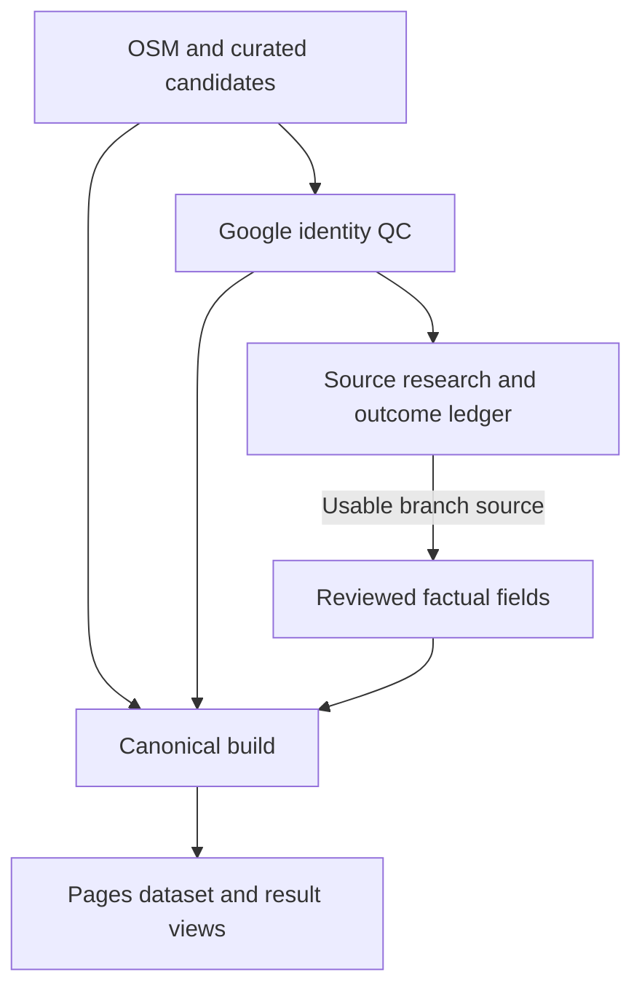

# Eat Architecture

## 1. Architecture summary

Eat remains intentionally static: no runtime application server, no runtime database, and no browser-side Places API key.

Current implementation was rechecked against `8c01e125` on 2026-09-05. Progress counts and the ordered work queue are maintained in `DEVELOPMENT.md`.



The central design distinction is:
- Google Places answers **which real business identity this source record corresponds to**;
- independent/curated sources provide long-lived display and recommendation metadata;
- the browser consumes one precompiled production dataset and performs no source matching.

## 2. Runtime frontend

### `index.html`
Current public page contains:
- a read-only current scope (`TOKYO / 地区1️⃣ / 1.2 km`);
- three optional filters;
- one generate action;
- one result container;
- compact database statistics;
- service attribution and privacy/terms links.

It loads Leaflet 1.9.4 for map presentation and exactly two local JavaScript assets:
1. `data/production_area1.js`;
2. `app.js`.

Future profiles/areas are not shown as interactive controls until data exists.

### `app.js`
Browser responsibilities are deliberately limited to:
- filter state;
- absolute 1.2 km safety check;
- weighted Web Crypto random selection;
- cuisine-diversity preference;
- rendering three result cards;
- rendering the Leaflet/OpenStreetMap overview and one map per store;
- rendering the three-store comparison table;
- direct Place-ID-based Google Maps links;
- compact production statistics.

The browser does **not**:
- read raw OSM/Tabelog/Google maintenance datasets;
- match businesses by name/address;
- merge enrichment sources;
- use Google Places response coordinates/content for Leaflet maps;
- use iframe maps;
- call Google Places or evaluate source-resolution ledgers at recommendation time.

Opening/holiday fields are currently descriptive and do not exclude restaurants from the eligible pool.

### `styles.css`
CSS owns presentation only: mobile-first yellow/white visual system, filter controls, cards, overview/store maps, comparison table, badges, statistics and legal pages.

## 3. Canonical production build

### `scripts/build_production_dataset.mjs`
This is the data boundary between maintenance and runtime.

Inputs currently include:
- curated historical restaurant data;
- bulk/more Area1 enrichment data;
- `area1_osm.js`;
- manual Google identity hints;
- generated Google verification overlay;
- 百名店 metadata;
- all `source_enrichment*.js` shards containing Place-ID-keyed Tabelog/official field evidence.

Build rules:
1. only `TOKYO / 地区1️⃣` is considered;
2. a production identity requires `googleStatus === 'verified'` and a Google Place ID;
3. rows sharing a Place ID collapse to one canonical entity;
4. an external row without a Place ID may enrich an entity only when its normalized name resolves to exactly one verified identity;
5. independently sourced coordinates/distance are preferred for durable geospatial metadata;
6. every production distance must be <=1,200 m;
7. missing budget/dishes/opening data stays missing;
8. duplicate Place IDs fail the build.

Place-ID enrichment attaches only to already verified identity groups and cannot self-verify or admit new restaurants. Field-specific `sourceRefs` claims and `suppressFields` controls take precedence over legacy fallback data; richer independently maintained source records supply display fields, while OSM coordinates/distance are preferred.

`source_resolution*.js` is read by the maintenance audits and source queue, not by the canonical builder. A `listing_hold`, `ambiguous`, `no_current_usable_source` or `source_not_found` record therefore does not automatically remove the corresponding restaurant from production. The three recorded operating-status conflicts are awaiting targeted QC; see `DEVELOPMENT.md`.

Output:
- `data/production_area1.js` generated at build/deploy time.

The generated file is the only restaurant dataset published to the browser.

## 4. Google identity and verification

### `scripts/verify_google_places.py`
Maps independent source candidates to Google Place IDs.

Workflow:
```text
source candidate
 -> Text Search (Place ID only)
 -> transient Place Details QC
 -> source-ID keyed verification result
 -> persist only status + Place ID + compact reason/version
```

Transient QC checks:
- permanently closed;
- Google location inside Area1;
- source/Google geographic compatibility;
- current food-related Google type;
- name compatibility for non-close matches.

Japanese/English transliteration is handled conservatively: a very close geographic hit from name-based Text Search may pass despite low literal string similarity; wider matches require stronger name evidence.

Generated overlay matching is by exact source ID rather than normalized name, avoiding same-name chain/branch collisions.

### Persistent Google state
Durable repository state is limited to fields needed for identity/audit, principally:
- source ID;
- verification status;
- Google Place ID;
- compact reject/pending reason;
- QC version.

Google display names, formatted addresses, coordinates, Maps URIs and place types used for verification are transient and are not written into the long-lived verification cache.

The current compact cache does not record a verification timestamp. Normal verification skips existing terminal QC-v4 entries. The next operating-status recheck needs an explicit targeted refresh path and a dated compact outcome; that work is planned, not implemented by this documentation update.

## 5. Google coverage discovery

### `scripts/discover_google_area1.py`
Purpose: coverage audit of food-related Google business identities inside Area1.

The script:
- queries overlapping nearby-search cells;
- splits dense queries by current food-related place types to reduce the 20-result truncation risk;
- uses coordinates/business status only transiently to enforce the 1.2 km boundary and remove permanent closures;
- persists only the deduplicated Google Place ID inventory.

Output:
- `data/area1_google_ids.json`.

This inventory measures Google-side identity coverage. A Place ID in the inventory is not automatically browser-ready until independent long-lived metadata is attached to it.

### Legacy full Places cache migration
`scripts/migrate_google_inventory.py` extracts Place IDs from the historical full Google discovery dataset without making API calls.

`.github/workflows/migrate-google-storage.yml` then removes the legacy full Places JSON/JS after the ID inventory has been preserved.

## 6. Independent data sources

### OpenStreetMap
`scripts/build_area1_osm.py` collects independent food POI candidates and durable geospatial metadata inside the Area1 radius.

OSM candidates do not enter production until Google identity verification succeeds.

### Tabelog / official / curated enrichment
Useful for factual enrichment such as:
- cuisine taxonomy;
- lunch/dinner price bands;
- representative dishes;
- opening hours / regular holidays;
- 百名店 metadata.

Identity matching should prefer Place ID and branch-aware evidence. Ambiguous enrichment remains unresolved.

`source_enrichment*.js` records the usable source bindings and exact field evidence. `source_resolution*.js` records researched exceptions with status, reason, date and evidence URLs. Source-outcome accounting includes both sets; 100% accounting is distinct from usable-source coverage and field completeness.

## 7. Recommendation algorithm

Filter canonical rows by the absolute 1.2 km boundary, cuisine exclusions, budget and selected distance. Group eligible rows by primary cuisine, choose weighted random restaurants across different groups and fill any remaining slots from unused eligible restaurants. Shuffle the three selected identities, then use that same result set for the overview map, cards/store maps and comparison table.

Hard rule: if at least three distinct production entities satisfy filters, return three.

Cuisine diversity is a preference, not a failure condition.

Weights:
- ordinary: `1.0`;
- verified 百名店: `2.2`.

No rating/review popularity ranking is used.

## 8. Budget behavior

Lunch and dinner remain separate fields.

The browser no longer chooses a budget field based on local clock time. A budget-specific filter passes when at least one known lunch/dinner interval overlaps the selected band. The card displays available lunch/dinner bands explicitly.

## 9. Result presentation

Every successful result provides:
1. a Leaflet/OpenStreetMap overview fitted to the three selected stores, with numbered markers;
2. three restaurant cards with known facts and one small Leaflet map per store when coordinates exist;
3. a horizontal comparison of the same three numbered restaurants;
4. direct Google Maps links with `query_place_id` for business lookup/navigation.

Maps use canonical independent coordinates and never display the private Area1 anchor. Before rerendering, the app removes previous Leaflet map instances. Map presentation and the comparison table consume the same canonical data as the cards; they do not create another source-matching layer.

## 10. Deployment and validation

### `.github/workflows/pages.yml`
Deployment flow:
1. checkout;
2. build canonical dataset;
3. JavaScript/Python syntax checks, repository audit and source-binding audit;
4. generate coverage/source queue reports and upload the three-day `eat-data-audit` artifact;
5. assemble `_site` containing only deployable assets;
6. upload a review artifact for pull requests, or deploy `_site` to Pages for main/manual runs.

Raw maintenance files, scripts and verification caches are not copied into the public artifact.

### `scripts/audit_repository.mjs`
Blocking checks include:
- canonical production pool >=3;
- unique Google Place IDs;
- all production rows verified;
- all distances within 1.2 km;
- no Google Places response fields such as Maps URI/display name/business status/type in the canonical production records;
- public page loads Leaflet 1.9.4 and retains overview/store-map/comparison rendering hooks;
- iframe maps, legacy Google payloads and maintenance overlays are absent from the public runtime;
- exactly two local runtime scripts are loaded: production data + `app.js`;
- source-enrichment records have supported provenance and do not self-verify.

### Source-binding audit and completeness reports

`audit_source_bindings.mjs` validates that enrichment and exception records attach to current production identities, have valid structure/evidence, and do not assign both a usable binding and an exception to the same Place ID.

`coverage_report.mjs` reports candidate/QC counts and field/distance coverage. `source_queue.mjs` calculates source-outcome completeness. A nonzero source queue currently only appears in the report; it does not fail CI. The binding audit's `unresolvedByBindingAudit:0` is a fixed output, not that calculation. An enforced completeness gate and additional field-gap metrics remain planned maintenance improvements.

These checks validate repository contracts and data consistency. They do not refresh restaurant operating status, verify the truth of remote source content or replace browser interaction testing.

### `.github/workflows/pr-review.yml`
Read-only PR validation workflow. It does not deploy and does not receive the Google API secret.

## 11. Security and policy boundaries

- `GOOGLE_MAP_API` stays in GitHub Actions Secrets.
- Browser JavaScript never receives the Places API key.
- Google field masks are kept narrow.
- Place ID is the durable Google identity key.
- Google Places response content used for QC is transient unless current platform terms explicitly permit storage.
- The public UI includes Google Maps attribution and uses direct Google Maps navigation links.
- OSM-derived public metadata retains OpenStreetMap attribution.

## 12. Remaining work

The ordered plan is in `DEVELOPMENT.md`:
1. targeted current-status QC for the three source/operating-status conflicts;
2. field extraction for the 237 usable-source restaurants, with reproducible gap reporting;
3. resolution of branch/source exceptions, then distance-balanced verification in the empty 800–1,200 m production ring and separate curated-overlap recovery;
4. opening/holiday exclusion after schedule semantics and coverage are ready;
5. Area2/SHIZUOKA once their production data is ready, and local history after persistence/privacy semantics are defined.

The Leaflet overview, per-store maps and three-store comparison are implemented requirements throughout this work.
